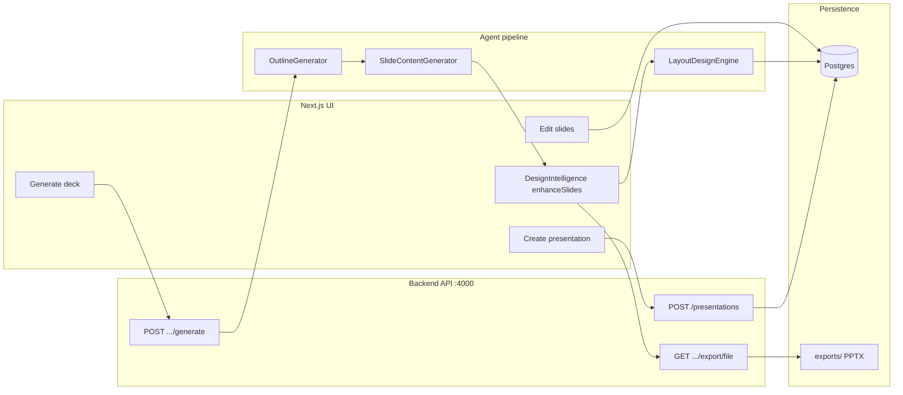

# Agentic workflow — AI PPT Generator

This document describes **how AI agents and background jobs cooperate** in this repo: data flow, code locations, and operational rules for humans and coding agents.

## Repository layout

| Area | Path | Role |
|------|------|------|
| **API** | `backend/` | Fastify + Prisma + Postgres; LLM “agents”; export; BullMQ queues |
| **LF AI UI** | `next-frontend/` | Next.js: **`/`** sign-in landing (`SignInHome`), **`/app`** main workspace (`LfAiApp`); session in `localStorage` (`ai_ppt_user`); `GET /api/export/[id]` proxies PPTX export |
| **Legacy UI** | `frontend/` | (If present) alternate client — prefer `next-frontend` for new work |

## Gamma-style editor (preview + per-slide options)

The **Next.js editor** (`next-frontend/src/components/LfAiApp.tsx`) follows a **Gamma-like** flow:

1. **Full-deck preview** — All slides render in a **vertical scroll** (not a single selected slide only), **Playfair** display titles, gradient headings optional. Default template **`gammaDefault`** (`templates.ts`) matches the dark deck canvas (`#05070c` / `#0c1118`); choosing another template at generation time applies that theme to **preview and PPTX**.
2. **Per-slide JSON** — `slide.content.gammaStyle` stores layout and chrome (see `src/lib/gammaTypes.ts`): layout preset (`hero_split`, `three_cards`, `stats_split`, …), content alignment, card width (M/L), full-bleed, card color override, gradient title toggle.
3. **Customize UI** — `SlideCustomizePopover` mirrors Gamma-style controls (layout row, color, toggles, alignment).
4. **AI edit shell** — `SlideAiEditModal` provides prompt + quick-action buttons; **wire these** to a future `POST /api/v1/slides/:slideId/ai-edit` (or similar) that returns updated slide JSON.
5. **Rendering** — `GammaSlideRenderer` uses `LfAiApp`’s `gammaEditorTheme` (full template: page, card, title, body). **PPTX export** merges theme JSON from `mergePresentationTemplateTheme` (`presentation-theme.ts`): uses **`Presentation.templateKey`** (set at create from `templateName`) plus optional **`Template.theme`**, so the chosen palette applies even if the template FK was not linked. **`resolveGammaExportTheme`** (`gamma-deck-theme.ts`): **`gammaDefault`** or **no template name** → dark Gamma deck; **any other key** (e.g. `clementa`) → full template colors for export.

### Premium deck JSON → DB + PPTX

- **POST** `/api/v1/presentations/:presentationId/premium-deck` — body `{ "slides": [ { "type", "title", "subtitle", "points", "highlight", "imageQuery" } ] }` or **empty body** to apply the built-in **Artificial Intelligence** sample (replaces all slides).
- Slide `content` stores `slideType`, `subtitle`, `highlight`, `bullets`, `references`, `gammaStyle`.
- **Export** maps slides through `gamma-export-pptx.ts` (and `slideType` / `gammaStyle` presets).

### Sign-in → workspace

1. User opens **`/`** — email + password (client validation); **Sign in** calls **`POST /api/v1/auth/login`** (find or create user by email). Alias: `POST /api/v1/users/login`.
2. On success, client stores `{ userId, email }` and navigates to **`/app`**.
3. **`/app`** renders `LfAiApp` only if a stored session exists; **Sign out** clears the client session only — **presentations stay in Postgres** under the same `userId`. Signing in again with the same email loads **`GET /api/v1/users/:userId/presentations`** and reopens the most recently active deck (or pick one from **Your decks**).

## End-to-end user journey



---

## 1. Presentation generation (multi-agent pipeline)

**Trigger:** `POST /api/v1/presentations/:presentationId/generate` with optional `slideCountTarget`.

**Queue:** Work is enqueued on **BullMQ** (`generateQueue`). A **worker** (`backend/src/workers/runner.ts`) must be running with **Redis** for jobs to complete. If Redis/worker is down, jobs stay queued.

**LangGraph (optional):** Set `USE_LANGGRAPH_GENERATION=1` and `OPENAI_API_KEY` in `backend/.env`. The worker runs `generation.langgraph.service.ts`: **outline → content → LangChain enrich (structured rewrite) → design intelligence (`enhanceSlides`) → layout → slide critic/refiner loop → slide quality enhancer → persist**. Improves copy vs the classic linear pipeline. Without the flag (or without an API key), the worker uses the classic `runPresentationGeneration` path.

**Design Intelligence (`backend/src/services/designIntelligence.service.ts`):** Pure, deterministic pass after slide content (and after LangGraph enrich when enabled). Classifies each slide (`hero`, `section`, `content`, `stat`, `split`, `visual`), adds `subtitle`, `description`, `highlight`, `visualPriority`, `contentDensity`, `imageQuery`, and `gammaStyle` (`layoutPreset`, `alignment`, `emphasisWords`). Feeds richer JSON into `LayoutDesignEngine` and persisted slide `content` for Gamma-style preview/export.

**Sequential agents** (see `backend/src/services/generation.service.ts`):

| Step | Class | File | Output |
|------|--------|------|--------|
| 1 | `OutlineGenerator` | `backend/src/agents/outline-generator.ts` | Sections + per-slide intent |
| 2 | `SlideContentGenerator` | `backend/src/agents/slide-content-generator.ts` | Titles, bullets, notes, references |
| 3 | `enhanceSlides` | `backend/src/services/designIntelligence.service.ts` | Slide archetypes + Gamma hints + tightened copy |
| 4 | `LayoutDesignEngine` | `backend/src/agents/layout-design-engine.ts` | `visualPlan` + slide layout JSON |
| 5 | `slideCriticAgent` + `slideRefinerAgent` | `backend/src/agents/slideCriticAgent.ts`, `backend/src/agents/slideRefinerAgent.ts` | Per-slide critique, targeted refinement (max 2 passes), deck-level anti-repetition/layout diversity |
| 6 | `runSlideQualityEnhancer` | `backend/src/agents/slideQualityEnhancer.ts` | Final quality polish + scoring |

**LLM:** `OpenAIProvider` (`backend/src/llm/openaiProvider.ts`) when `OPENAI_API_KEY` is set. Each agent accepts optional `LLMProvider`; if missing, **deterministic scaffolds** run so local dev works without API keys.

**Persistence:** Slides are recreated in a transaction; presentation status moves to completed (see generation service for final status).

**Job polling:** Clients use `GET /api/v1/jobs/:jobId` to track `QUEUED` → `PROCESSING` → `COMPLETED` / `FAILED`.

---

## 2. Export to PPTX (file artifact)

**Primary path for download:** `GET /api/v1/presentations/:presentationId/export/file`

- Creates an export **job**, runs **`runPresentationExport`** in-process, then **streams** the `.pptx`.
- **Long-running** by design; the Next app should call **`/api/export/[presentationId]`** (same origin) so the browser is not blocked by cross-origin/long-lived `fetch` to port 4000 alone.

**Implementation:** `backend/src/services/export.service.ts` (PptxGenJS, images via **Picsum** seeded by query; optional OpenAI images only if `EXPORT_USE_OPENAI_IMAGES=1` — see `backend/src/config/env.ts`).

**Static serving:** Exported files under `exports/` may be exposed via `/local-exports/` (see `server.ts`).

---

## 3. Environment variables (backend)

| Variable | Purpose |
|----------|---------|
| `DATABASE_URL` | Postgres |
| `REDIS_URL` | BullMQ worker |
| `OPENAI_API_KEY` | LLM + optional export images |
| `API_BASE_URL` | Public API base URL |
| `EXPORT_USE_OPENAI_IMAGES` | `1` = fallback to OpenAI for slide images if Picsum fails |
| `EXPORT_FAST_IMAGES` | Picsum only; never OpenAI |
| `EXPORT_FETCH_TIMEOUT_MS` / `EXPORT_OPENAI_IMAGE_TIMEOUT_MS` | Network / OpenAI timeouts |

Copy from `backend/.env.example` and adjust locally.

---

## 4. Conventions for coding agents (Cursor / automation)

1. **Generation changes** — Extend or modify the three agent classes; keep **Zod** schemas and `backend/src/types/ai.ts` in sync with JSON stored on slides.
2. **Export changes** — Only touch `export.service.ts` and presentation routes under `export/*`; avoid blocking the event loop without streaming for huge files.
3. **Frontend** — API base: `next-frontend` env (`NEXT_PUBLIC_API_BASE_URL`, `BACKEND_URL` for server-side proxy).
4. **Hooks / React** — Never place conditional `return` before hooks; mount guards go **after** all hooks.
5. **Jobs** — If you add a new queue job type, update `backend/src/queue/job-types.ts` and worker runner.

---

## 5. Quick commands

```bash
# Backend API
cd backend && npm run dev

# Worker (generation queue)
cd backend && npm run dev:worker

# Next frontend
cd next-frontend && npm run dev
```

---

## 6. Related files checklist

- [ ] `backend/src/services/generation.service.ts` — orchestration
- [ ] `backend/src/services/export.service.ts` — PPTX
- [ ] `backend/src/routes/presentation-routes.ts` — HTTP surface
- [ ] `backend/src/workers/runner.ts` — BullMQ consumer
- [ ] `next-frontend/src/app/api/export/[presentationId]/route.ts` — export proxy

---

*Update this file when you add agents, queues, or API steps.*
